# Survival Co-pilot — Architecture

Off-grid wilderness AI co-pilot. A hiker sends a short text query over a
Meshtastic LoRa mesh; a MacBook base station grounds the answer in a local
knowledge base (RAG) and a local LLM, then replies back over the mesh.
**No internet, no cell, no cloud** — everything inside the base station runs
100% on-device (the QVAC "unstoppable / private / local" thesis).

```mermaid
flowchart TB
    subgraph FIELD["FIELD - off-grid"]
        H["Handheld Meshtastic device<br/>(hiker)"]
    end

    subgraph RADIO["RADIO"]
        W["LoRa / Meshtastic Node<br/>LoRa &lt;-&gt; BLE"]
    end

    subgraph MAC["BASE STATION - MacBook (100% local)"]
        direction TB
        subgraph P1["PROCESS 1 - bot.py (Python, owns BLE)"]
            BOT["subscribe receive<br/>filter trigger prefix '?'<br/>language detect (CJK ratio)<br/>clean_reply + chunk &le;200B (UTF-8 safe)"]
        end
        subgraph RAGL["RAG layer (pure Python)"]
            COR["knowledge/{zh,en}/*.md<br/>bilingual corpus - 44 chunks"]
            IDX["knowledge/index.json"]
            RET["retriever.py<br/>numpy cosine top-k<br/>threshold 0.40 -> refuse"]
        end
        subgraph P2["PROCESS 2 - qvac serve openai (Node)"]
            EMB["/v1/embeddings - embed-mlm<br/>EmbeddingGemma 300M Q4<br/>768-dim, L2-normalized"]
            LLM["/v1/chat/completions - co-pilot<br/>Qwen3-1.7B Q4, temp 0.1, /no_think"]
        end
    end

    subgraph DON["DONATION LAYER - optional, decoupled (Q&amp;A stays free)"]
        DGEN["donate.html (at home)<br/>WDK client-side sign<br/>tiers $1/$5/$20 or free input"]
        TRON["TRON USDT settlement<br/>batch on return - demo: Nile testnet<br/>one-way gift, no balance/refunds"]
    end

    H   -- "1. ?query (LoRa mesh)" --> W
    W   -- "BLE (single-owner)"     --> BOT
    BOT -- "2. embed query (HTTP)"  --> EMB
    EMB -- "query vector"           --> RET
    COR -- "build: index.py"        --> IDX
    IDX -- "load at startup"        --> RET
    RET -- "top-k context / refuse if max&lt;0.40" --> BOT
    BOT -- "3. prompt + context (HTTP)" --> LLM
    LLM -- "answer"                 --> BOT
    BOT -- "BLE"                    --> W
    W   -- "4. chunked reply (LoRa mesh)" --> H

    DGEN -. "channel A: !donate string + QR (on mesh)" .-> BOT
    BOT  -. "verify Ed25519, queue pending" .-> TRON
    BOT  -. "channel B: !support -> address + QR + lifetime total" .-> TRON
    style DON fill:#2a2410,stroke:#e3b341
```

> The dotted **donation layer** is optional and fully decoupled from the `?`
> Q&A path, which has zero wallet checks. Donations fund the base station's
> ongoing cost (power, maintenance) and the longer-term vision of solar-powered
> stations in remote mountains — see `wallet/DESIGN.md` / `wallet/DESIGN.en.md`.

## Request flow

1. **Query in** — handheld -> LoRa mesh -> Node (RX) -> BLE -> `bot.py` (passes `?` prefix filter).
2. **RAG retrieve** — `bot.py` embeds the query via `/v1/embeddings`; `retriever.py` runs cosine top-k against `index.json`. If the top score is **< 0.40**, refuse **before** the LLM call. Otherwise prepend the matched chunks as context.
3. **LLM generate** — `bot.py` -> `/v1/chat/completions` (co-pilot, temp 0.1, `/no_think`) -> answer.
4. **Reply out** — `clean_reply()` strips empty `<think>` shells -> chunker splits to <=200B (never mid-codepoint) -> `bot.py` sendText DM -> Node (TX) -> LoRa mesh -> handheld.

## Why this shape

- **Two processes bridged by HTTP** — `@meshtastic/js` only does BLE via browser Web Bluetooth; `meshtastic-python`'s BLE is stable on macOS. QVAC SDK is Node-only. HTTP on `127.0.0.1:11434` is the clean seam between the Python radio owner and the Node LLM server.
- **Pure-Python retriever (not `@qvac/rag`)** — avoids a Node<->Python bridge; HyperDB is overkill for hackathon scope.
- **Cross-lingual retrieval with no language tags** — EmbeddingGemma shares one semantic space across 100+ languages, so a Chinese query retrieves relevant English chunks and vice versa.
- **macOS BLE is single-owner** — quit the Meshtastic.app GUI (Cmd+Q) before running `bot.py`, or the BLE scan hangs.

## Models (aliases in `qvac.config.json`)

| Alias | Model | Role |
|-------|-------|------|
| `co-pilot` | `QWEN3_1_7B_INST_Q4` | chat / completions |
| `embed-mlm` | `EMBEDDINGGEMMA_300M_Q4_0` | embeddings (RAG) |
